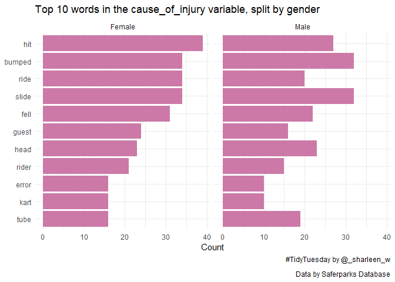

Tidy Tuesday: Roller coaster injuries :roller\_coaster:
================
September 9, 2019

``` r
library(dplyr)
library(readr)
library(skimr)
library(lubridate)
library(janitor)
library(naniar)
library(tidytext)
library(stringr)
library(tidyr)
library(ggplot2)
library(forcats)
library(glue)
```

## Import data

``` r
tx_injuries_raw <- readr::read_csv("https://raw.githubusercontent.com/rfordatascience/tidytuesday/master/data/2019/2019-09-10/tx_injuries.csv",
                                   col_types = cols()) %>%
  clean_names()


na_strings <- c("n/a",
                "N/A",
                "unknown",
                "Unknown")
```

## Data wrangling

``` r
tx_injuries <- tx_injuries_raw %>%
  mutate(cause_of_injury = str_to_lower(cause_of_injury),
         gender = str_to_upper(gender),
         gender = case_when(gender == "F" ~ "Female",
                            gender == "M" ~ "Male")) %>%
  replace_with_na_all(condition = ~.x %in% na_strings) %>%
  mutate(janitor_date = as.numeric(injury_date) %>%
           janitor::excel_numeric_to_date(.),
         lubridate_date = lubridate::mdy(injury_date),
         real_date = coalesce(janitor_date, lubridate_date)) %>%
  select(-injury_date,
         -janitor_date,
         -lubridate_date) %>%
  mutate(age = case_when(age == "30s" ~ "35",
                         age == "mid-60s" ~ "65"))
```

## Plotting function

Create a function to plot top 10 tokens of the open-text variables

``` r
# Top injury tokens, split by gender ----

injuries_by_token_plot <- function(df, title_var) {
  
  top_10_injuries <- df %>%
    count(word, sort = TRUE) %>%
    top_n(10, n)
  
  df %>%
    select(gender, word) %>%
    inner_join(top_10_injuries) %>%
    count(gender, word) %>%
    arrange(gender, -n) %>%
    mutate(word = word %>%
             forcats::as_factor() %>%
             fct_infreq() %>%
             fct_rev()) %>%
    ggplot() +
    geom_col(aes(x = word,
                 y = n),
             fill = "#CC79A7") +
    xlab(NULL) +
    ylab("Count") +
    coord_flip() +
    facet_wrap(~ gender) +
    theme_minimal() +
    labs(caption = "#TidyTuesday by @_sharleen_w
         
         Data by Saferparks Database") +
    ggtitle(glue("Top 10 words in the {title_var} variable, split by gender"))
  
}
```

## Three examples of the function

### Top ten words for `cause_of_injury`, split by gender

``` r
tx_injuries %>%
  unnest_tokens(word, cause_of_injury) %>%
  anti_join(stop_words) %>%
  filter(!is.na(word) &
           !is.na(gender)) %>%
  injuries_by_token_plot("cause_of_injury")
```

<!-- -->

### Top ten words for `body_part`, split by gender

``` r
tx_injuries %>%
  unnest_tokens(word, body_part) %>%
  anti_join(stop_words) %>%
  filter(!is.na(word) &
           !is.na(gender)) %>%
  injuries_by_token_plot("body_part")
```

<!-- -->

### Top ten words for `alleged_injury`, split by gender

``` r
tx_injuries %>%
  unnest_tokens(word, alleged_injury) %>%
  anti_join(stop_words) %>%
  filter(!is.na(word) &
           !is.na(gender)) %>%
  injuries_by_token_plot("alleged_injury")
```

<!-- -->

``` r
ggsave("alleged_injury_plot.png", device = "png", width = 8, height = 6, units = "in", dpi = 500)
```
