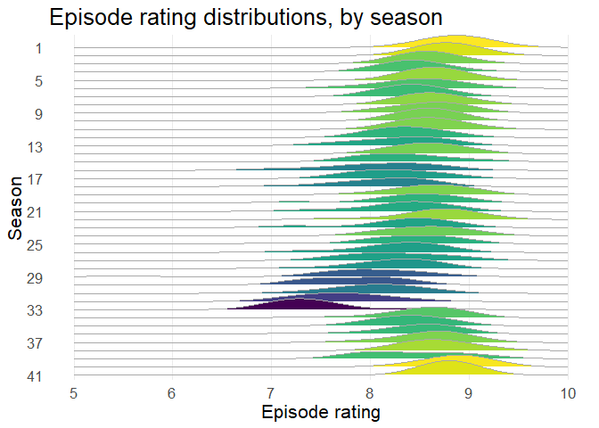

Chopped\! :hocho:
================
August 25, 2020

# Import data

``` r
library(dplyr)
library(ggplot2)
library(forcats)
library(viridis)

chopped <- readr::read_tsv('https://raw.githubusercontent.com/rfordatascience/tidytuesday/master/data/2020/2020-08-25/chopped.tsv') %>% 
  filter(season <= 41) %>%
  mutate(season_as_character = as.character(season))
```

# See how ratings change over each season

``` r
chopped_for_plot <- chopped %>%
  mutate(season_as_fct = season_as_character %>%
           fct_inorder() %>%
           fct_rev()) %>%
  group_by(season_as_fct) %>%
  mutate(avr_rating_per_season = mean(
    episode_rating,
    na.rm = TRUE)) %>%
  ungroup()

chopped_plot_lvls <- levels(chopped_for_plot[["season_as_fct"]])

plot <- chopped_for_plot %>%
  ggplot() +
  ggridges::geom_density_ridges(
    aes(
      x = episode_rating,
      y = season_as_fct,
      fill = avr_rating_per_season),
    colour = "darkgrey") +
  theme_minimal() +
  labs(
    x = "Episode rating",
    y = "Season",
    title = "Episode rating distributions, by season") +
  # Code from here: https://stackoverflow.com/questions/32278215/show-every-nth-row-name-in-ggplot2
  scale_y_discrete(breaks = chopped_plot_lvls[seq(1,
                                                  length(chopped_plot_lvls),
                                                  by = 4)]) +
  scale_fill_viridis() +
  xlim(5, 10) +
  theme(
    legend.position="none",
    axis.line = element_blank(),
    axis.ticks.x = element_blank(),
    axis.ticks.y = element_blank(),
    panel.grid.major.y = element_blank(),
    panel.grid.minor = element_blank(),
    text = element_text(size=16))

plot
```

<!-- -->

``` r
ggsave(
  "ratings_dist.png",
  device = "png",
  width = 6,
  height = 8,
  units = "in",
  dpi = 500)
```
