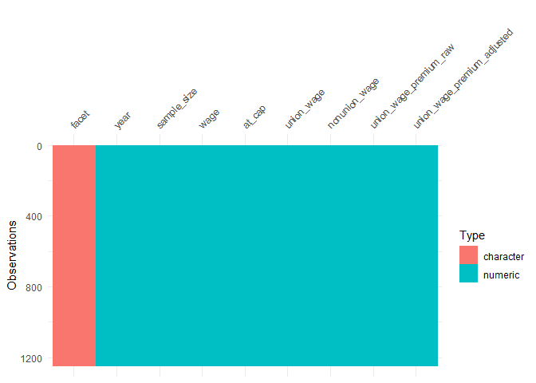
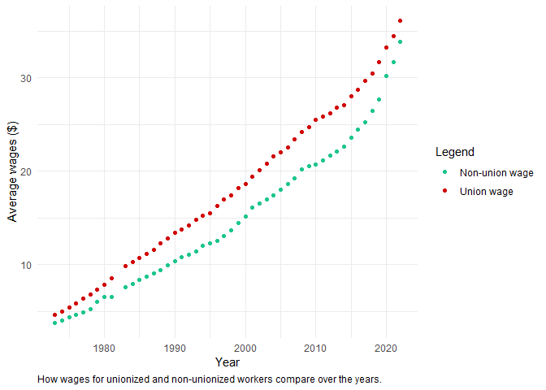
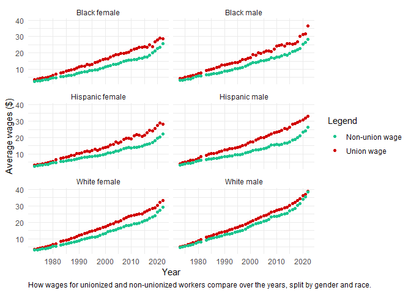

# Union Membership Wages
Sharleen Weatherley
2023-09-05

## Setup

First I will call the necessary libraries and read in the data, found at
the [`tidytuesday` Github
repository](https://github.com/rfordatascience/tidytuesday/tree/master/data/2023/2023-09-05).

This data was curated by [unionstats.com](unionstats.com).

``` r
# Library calls
library(dplyr)
library(visdat)
library(skimr)
library(ggplot2)
library(janitor)
library(stringr)

# Reading the data in
wages <- readr::read_csv('https://raw.githubusercontent.com/rfordatascience/tidytuesday/master/data/2023/2023-09-05/wages.csv')


# Set graph theme
theme_set(theme_minimal()) +
  theme_update(
    plot.caption = element_text(hjust = 0))
```

## Initial thoughts

From the data dictionary on the Github repo, it looks like the `wages`
dataset will be the most interesting data for me, so I will start by
getting an overview of what the dataset looks like.

## Exploring

``` r
wages |> 
  vis_dat()
```



Good, from this `vis_dat()` graph, I can see there’s no missing
variables. The data is nice and cleaned.

Now I will use the `skimr::skim()` function on the data.

``` r
wages |> 
  skim()
```

|                                                  |       |
|:-------------------------------------------------|:------|
| Name                                             | wages |
| Number of rows                                   | 1247  |
| Number of columns                                | 9     |
| \_\_\_\_\_\_\_\_\_\_\_\_\_\_\_\_\_\_\_\_\_\_\_   |       |
| Column type frequency:                           |       |
| character                                        | 1     |
| numeric                                          | 8     |
| \_\_\_\_\_\_\_\_\_\_\_\_\_\_\_\_\_\_\_\_\_\_\_\_ |       |
| Group variables                                  | None  |

Data summary

**Variable type: character**

| skim_variable | n_missing | complete_rate | min | max | empty | n_unique | whitespace |
|:--------------|----------:|--------------:|----:|----:|------:|---------:|-----------:|
| facet         |         0 |             1 |  12 |  31 |     0 |       22 |          0 |

**Variable type: numeric**

| skim_variable               | n_missing | complete_rate |     mean |       sd |      p0 |     p25 |      p50 |      p75 |      p100 | hist  |
|:----------------------------|----------:|--------------:|---------:|---------:|--------:|--------:|---------:|---------:|----------:|:------|
| year                        |         0 |             1 |  1998.27 |    14.23 | 1973.00 | 1987.00 |  1999.00 |  2010.50 |   2022.00 | ▆▇▇▇▇ |
| sample_size                 |         0 |             1 | 44934.61 | 46449.48 |  265.00 | 6459.50 | 26550.00 | 77177.00 | 169102.00 | ▇▂▂▂▁ |
| wage                        |         0 |             1 |    15.79 |     8.37 |    2.63 |    9.21 |    14.60 |    21.30 |     48.17 | ▇▇▅▁▁ |
| at_cap                      |         0 |             1 |     0.02 |     0.02 |    0.00 |    0.00 |     0.01 |     0.02 |      0.15 | ▇▂▁▁▁ |
| union_wage                  |         0 |             1 |    18.33 |     8.84 |    3.21 |   11.18 |    17.43 |    24.88 |     43.30 | ▆▇▇▃▁ |
| nonunion_wage               |         0 |             1 |    15.23 |     8.37 |    2.46 |    8.65 |    13.91 |    20.53 |     48.98 | ▇▇▃▁▁ |
| union_wage_premium_raw      |         0 |             1 |     0.25 |     0.17 |   -0.19 |    0.15 |     0.24 |     0.35 |      0.77 | ▂▅▇▃▁ |
| union_wage_premium_adjusted |         0 |             1 |     0.19 |     0.10 |   -0.04 |    0.13 |     0.19 |     0.22 |      0.59 | ▂▇▃▁▁ |

Even from this `skim()` function, I can see that union wages tend to be
higher than non-union wages!

I’ll filter for all the workers, and create a graph to visualize this
difference over the years.

``` r
wages |> 
  filter(facet == "all wage and salary workers") |> 
  ggplot(aes(x = year)) +
  geom_point(aes(y = union_wage,
                 color = "Union wage")) +
  geom_point(aes(y = nonunion_wage,
                 color = "Non-union wage")) +
  labs(x = "Year",
       y = "Average wages ($)",
       color = "Legend",
       caption = "How wages for unionized and non-unionized workers compare over the years.") +
  scale_color_manual(values = c("#1dc58f",
                                "#d10707"))
```



## `facet` values

So what other values can the `facet` column have? I’ll use `janitor`’s
`tabyl()` function to check it out:

``` r
wages |> 
  janitor::tabyl(facet)
```

                               facet   n    percent
         all wage and salary workers 245 0.19647153
                        construction  49 0.03929431
          demographics: black female  49 0.03929431
            demographics: black male  49 0.03929431
       demographics: college or more  49 0.03929431
                demographics: female  49 0.03929431
       demographics: hispanic female  49 0.03929431
         demographics: hispanic male  49 0.03929431
     demographics: less than college  49 0.03929431
                  demographics: male  49 0.03929431
          demographics: white female  49 0.03929431
            demographics: white male  49 0.03929431
                 private sector: all  49 0.03929431
        private sector: construction  49 0.03929431
       private sector: manufacturing  49 0.03929431
     private sector: nonagricultural  49 0.03929431
               public administration  49 0.03929431
                  public sector: all  49 0.03929431
              public sector: federal  40 0.03207698
     public sector: local government  40 0.03207698
     public sector: state government  40 0.03207698
                    wholesale/retail  49 0.03929431

I’m interested to see if the demographics of gender and race show any
differences of wages over the years:

``` r
wages |> 
  filter(str_detect(facet, "male")) |>
  mutate(facet = facet |> 
           str_remove("demographics: ") |>
           str_to_sentence()) |> 
  filter(!(facet %in% c("Male", "Female"))) |> 
  ggplot(aes(x = year)) +
  geom_point(aes(y = union_wage,
                 color = "Union wage")) +
  geom_point(aes(y = nonunion_wage,
                 color = "Non-union wage")) +
  labs(x = "Year",
       y = "Average wages ($)",
       color = "Legend",
       caption = "How wages for unionized and non-unionized workers compare over the years, split by gender and race.") +
  scale_color_manual(values = c("#1dc58f",
                                "#d10707")) +
  facet_wrap(facet ~ ., ncol = 2)
```


