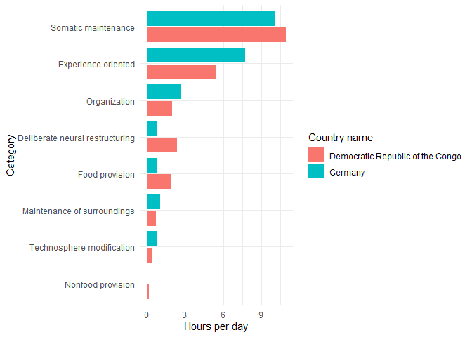

# The Global Human Day
Sharleen Weatherley
2023-09-21

## Setup

First I will call the necessary libraries and read in the data, found at
the [`tidytuesday` Github
repository](https://github.com/rfordatascience/tidytuesday/blob/master/data/2023/2023-09-12/readme.md).

``` r
# Library calls
library(dplyr)
library(janitor)
library(tidyr)
library(ggplot2)
library(forcats)
library(knitr)

# Reading the data in
all_countries <- readr::read_csv('https://raw.githubusercontent.com/rfordatascience/tidytuesday/master/data/2023/2023-09-12/all_countries.csv') |> 
  clean_names()

country_regions <- readr::read_csv('https://raw.githubusercontent.com/rfordatascience/tidytuesday/master/data/2023/2023-09-12/country_regions.csv') |> 
  clean_names()

# Set graph theme
theme_set(theme_minimal()) +
  theme_update(
    plot.caption = element_text(hjust = 0))
```

## Initial thoughts

Looking at the data in the two data frames, my first thoughts are that I
will join them together so that I can get `country_name` into the
`all_countries` data set.

``` r
all_countries |> 
  head(5) |>
  kable()
```

| category          | subcategory              | country_iso3 | region_code | population | hours_per_day_combined | uncertainty_combined |
|:------------------|:-------------------------|:-------------|:------------|-----------:|-----------------------:|---------------------:|
| Food provision    | Food preparation         | ABW          | AM_C        |     101665 |                   1.47 |            0.2376303 |
| Food provision    | Food growth & collection | ABW          | AM_C        |     101665 |                   0.17 |            0.0268798 |
| Food provision    | Food processing          | ABW          | AM_C        |     101665 |                   0.00 |            0.0075265 |
| Nonfood provision | Materials                | ABW          | AM_C        |     101665 |                   0.03 |            0.0020716 |
| Nonfood provision | Energy                   | ABW          | AM_C        |     101665 |                   0.05 |            0.0035968 |

``` r
country_regions |> 
  head(5) |> 
  kable()
```

| region_code | region_name     | country_name | m49_code | country_iso2 | country_iso3 | alt_country_name | alt_country_name1                       | alt_country_name2 | alt_country_name3 | alt_country_name4 | alt_country_name5 | alt_country_name6 | other_code1 | other_code2 |
|:------------|:----------------|:-------------|---------:|:-------------|:-------------|:-----------------|:----------------------------------------|:------------------|:------------------|:------------------|:------------------|:------------------|:------------|:------------|
| AF_N        | Northern Africa | Algeria      |       12 | DZ           | DZA          | Algeria          | People’s Democratic Republic of Algeria | NA                | NA                | NA                | NA                | NA                | NA          | NA          |
| AF_N        | Northern Africa | Egypt        |      818 | EG           | EGY          | Egypt            | Arab Republic of Egypt                  | NA                | NA                | NA                | NA                | NA                | NA          | NA          |
| AF_N        | Northern Africa | Libya        |      434 | LY           | LBY          | Libya            | State of Libya                          | NA                | NA                | NA                | NA                | NA                | NA          | NA          |
| AF_N        | Northern Africa | Morocco      |      504 | MA           | MAR          | Morocco          | Kingdom of Morocco                      | NA                | NA                | NA                | NA                | NA                | NA          | NA          |
| AF_N        | Northern Africa | Sudan        |      729 | SD           | SDN          | Sudan            | Republic of the Sudan                   | The Sudan         | NA                | NA                | NA                | NA                | NA          | NA          |

I also want to peak at the different options for categories and
subcategories:

``` r
all_countries |> 
  distinct(category, subcategory) |> 
  arrange_all() |> 
  kable()
```

| category                        | subcategory              |
|:--------------------------------|:-------------------------|
| Deliberate neural restructuring | Religious practice       |
| Deliberate neural restructuring | Schooling & research     |
| Experience oriented             | Active recreation        |
| Experience oriented             | Interactive              |
| Experience oriented             | Meals                    |
| Experience oriented             | Passive                  |
| Experience oriented             | Social                   |
| Food provision                  | Food growth & collection |
| Food provision                  | Food preparation         |
| Food provision                  | Food processing          |
| Maintenance of surroundings     | Inhabited environment    |
| Maintenance of surroundings     | Waste management         |
| Nonfood provision               | Energy                   |
| Nonfood provision               | Materials                |
| Organization                    | Allocation               |
| Organization                    | Human transportation     |
| Organization                    | Material transportation  |
| Somatic maintenance             | Health care              |
| Somatic maintenance             | Hygiene & grooming       |
| Somatic maintenance             | Physical child care      |
| Somatic maintenance             | Sleep & bedrest          |
| Technosphere modification       | Artifacts                |
| Technosphere modification       | Buildings                |
| Technosphere modification       | Infrastructure           |

# Joining the two data sets

The below `left_join` will add `country_name` to the `all_countries`
data set. I’m also going to get rid of some variables I won’t be needing
and `arrange` the data set.

``` r
all_countries <- all_countries |>
  left_join(
    country_regions |>
      select(country_iso3,
             country_name),
    by = "country_iso3") |> 
    select(country_name,
         category,
         subcategory,
         hours_per_day_combined) |> 
  arrange(country_name,
          category,
          subcategory)

all_countries |> 
  head(5) |> 
  kable()
```

| country_name | category                        | subcategory          | hours_per_day_combined |
|:-------------|:--------------------------------|:---------------------|-----------------------:|
| Afghanistan  | Deliberate neural restructuring | Religious practice   |                   0.29 |
| Afghanistan  | Deliberate neural restructuring | Schooling & research |                   1.33 |
| Afghanistan  | Experience oriented             | Active recreation    |                   0.23 |
| Afghanistan  | Experience oriented             | Interactive          |                   0.62 |
| Afghanistan  | Experience oriented             | Meals                |                   1.62 |

# Add an hour variable for the `category`

The `hours_per_day_combined` variable goes with the `subcategory`
variable. I am going to create an hour variable for the `category`
variable.

``` r
all_countries <- all_countries |> 
  rename(subcategory_hours_per_day = hours_per_day_combined) |> 
  group_by(country_name, category) |> 
  mutate(category_hours_per_day = sum(subcategory_hours_per_day),
         .after = subcategory) |> 
  ungroup()

all_countries |> 
  head(10) |> 
  kable()
```

| country_name | category                        | subcategory              | category_hours_per_day | subcategory_hours_per_day |
|:-------------|:--------------------------------|:-------------------------|-----------------------:|--------------------------:|
| Afghanistan  | Deliberate neural restructuring | Religious practice       |                   1.62 |                      0.29 |
| Afghanistan  | Deliberate neural restructuring | Schooling & research     |                   1.62 |                      1.33 |
| Afghanistan  | Experience oriented             | Active recreation        |                   6.32 |                      0.23 |
| Afghanistan  | Experience oriented             | Interactive              |                   6.32 |                      0.62 |
| Afghanistan  | Experience oriented             | Meals                    |                   6.32 |                      1.62 |
| Afghanistan  | Experience oriented             | Passive                  |                   6.32 |                      2.05 |
| Afghanistan  | Experience oriented             | Social                   |                   6.32 |                      1.80 |
| Afghanistan  | Food provision                  | Food growth & collection |                   2.12 |                      0.88 |
| Afghanistan  | Food provision                  | Food preparation         |                   2.12 |                      1.14 |
| Afghanistan  | Food provision                  | Food processing          |                   2.12 |                      0.10 |

# Visualize the two most different countries

Which two countries have the most different days? And how do they
compare?

Modifying
[this](https://stackoverflow.com/questions/67714078/how-to-get-the-pairwise-difference-of-all-values-within-uneven-categories-in-r)
Stackoverflow topic, I am going to find the maximum pairwise difference
between two countries and plot those two countries’ days.

``` r
country_pair_diff <- all_countries |> 
  distinct(country_name,
           category,
           category_hours_per_day) |> 
  group_by(category) |> 
  reframe(result = combn(seq_along(category_hours_per_day), 2, function(i)
    list(difference = diff(category_hours_per_day[i]),  #The difference
         country_pair = paste0(country_name[i], collapse = '-')), # The pairs
    simplify = FALSE)) |> 
  unnest_wider(result) |> 
  mutate(abs_difference = abs(difference)) |> 
  group_by(country_pair) |> 
  mutate(total_diff_country_pair = sum(abs_difference)) |> 
  ungroup()

country_pair_diff |> 
  arrange(country_pair) |> 
  head(10) |> 
  kable()
```

| category                        | difference | country_pair        | abs_difference | total_diff_country_pair |
|:--------------------------------|-----------:|:--------------------|---------------:|------------------------:|
| Deliberate neural restructuring |      -0.52 | Afghanistan-Albania |           0.52 |                    2.15 |
| Experience oriented             |       0.53 | Afghanistan-Albania |           0.53 |                    2.15 |
| Food provision                  |      -0.16 | Afghanistan-Albania |           0.16 |                    2.15 |
| Maintenance of surroundings     |       0.16 | Afghanistan-Albania |           0.16 |                    2.15 |
| Nonfood provision               |       0.03 | Afghanistan-Albania |           0.03 |                    2.15 |
| Organization                    |       0.09 | Afghanistan-Albania |           0.09 |                    2.15 |
| Somatic maintenance             |      -0.40 | Afghanistan-Albania |           0.40 |                    2.15 |
| Technosphere modification       |       0.26 | Afghanistan-Albania |           0.26 |                    2.15 |
| Deliberate neural restructuring |      -0.20 | Afghanistan-Algeria |           0.20 |                    2.46 |
| Experience oriented             |       1.07 | Afghanistan-Algeria |           1.07 |                    2.46 |

Now I can find the two most different countries. They will have the
largest `total_diff_country_pair`.

``` r
country_pair_diff |> 
  distinct(country_pair,
           total_diff_country_pair) |> 
  arrange(-total_diff_country_pair) |> 
  head(20) |> 
  kable()
```

| country_pair                                 | total_diff_country_pair |
|:---------------------------------------------|------------------------:|
| Democratic Republic of the Congo-Germany     |                    7.53 |
| Angola-Germany                               |                    7.42 |
| Cameroon-Germany                             |                    7.42 |
| Central African Republic-Germany             |                    7.42 |
| Chad-Germany                                 |                    7.42 |
| Equatorial Guinea-Germany                    |                    7.42 |
| Gabon-Germany                                |                    7.42 |
| Germany-Sao Tome and Principe                |                    7.42 |
| Bhutan-Germany                               |                    7.06 |
| Democratic Republic of the Congo-Japan       |                    6.97 |
| Democratic Republic of the Congo-Switzerland |                    6.95 |
| Democratic Republic of the Congo-Sweden      |                    6.91 |
| Democratic Republic of the Congo-Netherlands |                    6.89 |
| Angola-Japan                                 |                    6.86 |
| Cameroon-Japan                               |                    6.86 |
| Central African Republic-Japan               |                    6.86 |
| Chad-Japan                                   |                    6.86 |
| Equatorial Guinea-Japan                      |                    6.86 |
| Gabon-Japan                                  |                    6.86 |
| Japan-Sao Tome and Principe                  |                    6.86 |

# Graphing the two most different countries

So, with our knowledge now that the DRC and Germany have the most
different days, let’s plot the difference to see what it looks like:

``` r
all_countries |> 
  filter(country_name %in% c("Democratic Republic of the Congo",
                             "Germany")) |> 
  distinct(country_name, category, .keep_all = TRUE) |> 
  mutate(category = category |> 
           as.factor() |> 
           fct_reorder(category_hours_per_day)) |> 
  ggplot() +
  geom_col(aes(x = category,
               y = category_hours_per_day,
               fill = country_name),
           position = "dodge2") +
  labs(x = "Category",
       y = "Hours per day",
       fill = "Country name") +
  coord_flip()
```



It looks like the DRC spends more time on
`Deliberate neural restructuring`, which includes activities like
religious practice and schooling and research, whereas Germany spends
more time on `Experience oriented` activities, like active recreation,
interactive, social, passive, and meals.
